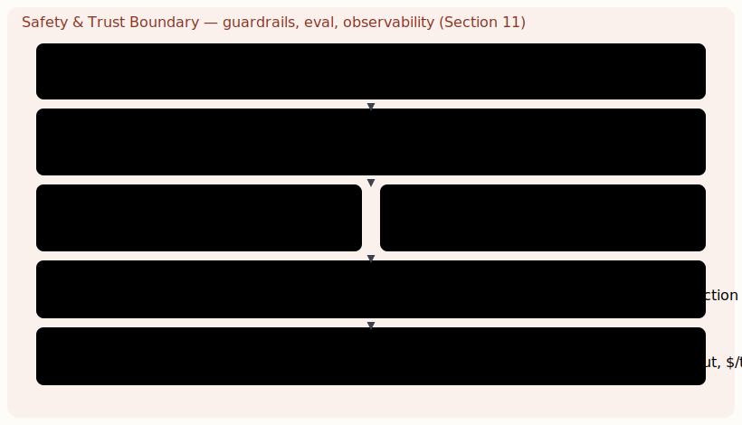

# The agentic stack — a mental model

[Guide index](README.md) · [How an LLM represents data: tokens, embeddings, vectors →](02-how-an-llm-represents-data-tokens-embeddings-vectors.md)

---

> Before any tool decision, fix the mental model. A production AI system is not "an LLM with a prompt." It is a stack of cooperating layers, each solving a problem the layer above cannot.

Most failed AI projects fail because the team optimised the wrong layer — they argued about LangChain versus LangGraph while the real bottleneck was retrieval quality or inference latency. The discipline of architecture is knowing which layer owns which guarantee. The diagram below is the spine of this entire paper; every later section drills into one band.

***Figure 1.** The six-layer agentic stack. Each band owns a distinct guarantee; the safety boundary is not a layer but an envelope around all of them. Read this paper bottom-up or top-down — both directions are valid architectures.*

> **KEY — Architect's heuristic**  
> The bottleneck is almost never the orchestration framework. In practice it is, in order: (1) retrieval quality, (2) inference latency and cost at the model layer, (3) the absence of evals and observability. Pick a framework that stays out of your way, then invest in those three. That alone puts a system ahead of most teams shipping agents today.

## The four questions an AI architecture must answer

1. **Where does truth live?** — the data layer and its contracts (§3).
2. **How is relevant truth found at query time?** — retrieval: vector, graph, hybrid (§4–6).
3. **How is reasoning controlled and made reliable?** — structured outputs and the orchestration runtime (§7–9).
4. **How do we keep it correct, bounded, and safe?** — customization discipline and the trust boundary (§10–11).

---

[Guide index](README.md) · [How an LLM represents data: tokens, embeddings, vectors →](02-how-an-llm-represents-data-tokens-embeddings-vectors.md)
