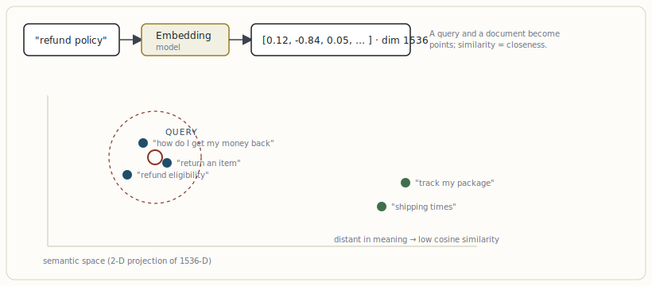

# How an LLM represents data: tokens, embeddings, vectors

[← The agentic stack — a mental model](01-the-agentic-stack-a-mental-model.md) · [Guide index](README.md) · [The data layer: cubes, medallion, semantic layer, feature stores →](03-the-data-layer-cubes-medallion-semantic-layer-feature-stores.md)

---

> Everything above the model layer is, mechanically, the manipulation of vectors. To architect retrieval and memory you must understand what a vector *is* and what distance between vectors *means*.

## From text to tokens to vectors

A language model never sees characters. Text is first **tokenized** — split into sub-word units (roughly ¾ of a word on average in English) and mapped to integer IDs. Each token ID indexes a learned **embedding**: a dense, fixed-length vector of floating-point numbers. A model with a 4096-dimensional hidden state represents every token as a point in 4096-dimensional space. Transformer attention then mixes these vectors so that each position's representation is conditioned on the others — that contextual mixing is what "understanding" reduces to mechanically.

For retrieval we use a separate kind of vector: a **sentence/document embedding**, produced by an embedding model (e.g. an OpenAI, Cohere, or open-source encoder). It compresses a whole chunk of text into a single vector — commonly 384, 768, or 1536 dimensions — such that *semantically similar text lands at nearby points*. This is the entire basis of semantic search: meaning becomes geometry.

***Figure 2.** Semantic search reduces to nearest-neighbour geometry. The query vector's neighbours (dashed radius) are the most relevant documents — regardless of shared keywords. "Get my money back" matches "refund" with zero lexical overlap.*

## Distance metrics — the one decision people get wrong

"Similarity" must be defined numerically. Three metrics dominate:

- **Cosine similarity** — the angle between vectors, ignoring magnitude. The default for text embeddings, because length encodes little meaning. Range −1…1.
- **Dot product** — cosine scaled by magnitudes; cheaper, but only equivalent to cosine when vectors are normalised. Many models output normalised vectors specifically so dot product = cosine.
- **Euclidean (L2)** — straight-line distance. Useful for some image/embedding spaces; usually inferior for text.

> **WARNING — Common failure**  
> Mixing metrics between indexing and querying, or feeding un-normalised vectors to a dot-product index, silently destroys recall. Pin the metric in your schema and assert that the embedding model and the index agree. This is the most common cause of "RAG that retrieves garbage."

## The curse of dimensionality (why exact search dies)

In high-dimensional space, distances between random points become almost uniform — everything is roughly equidistant from everything. Two consequences for architects: (1) **exact** nearest-neighbour search (compare the query to every vector) is O(N·d) and collapses past a few hundred thousand vectors; (2) embedding quality and chunking strategy matter more than index tuning, because a bad embedding makes all distances meaningless. The answer to (1) is *approximate* nearest-neighbour indexes — the subject of §4.

---

[← The agentic stack — a mental model](01-the-agentic-stack-a-mental-model.md) · [Guide index](README.md) · [The data layer: cubes, medallion, semantic layer, feature stores →](03-the-data-layer-cubes-medallion-semantic-layer-feature-stores.md)
