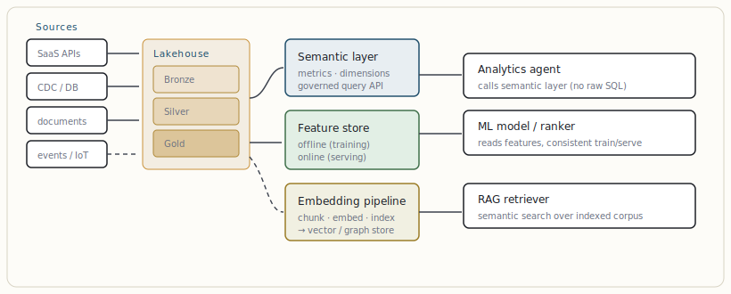

# The data layer: cubes, medallion, semantic layer, feature stores

[← How an LLM represents data: tokens, embeddings, vectors](02-how-an-llm-represents-data-tokens-embeddings-vectors.md) · [Guide index](README.md) · [Vector databases & semantic search →](04-vector-databases-semantic-search.md)

---

> An AI system is only as good as the truth beneath it. Retrieval and agents are downstream consumers; if the data layer is a swamp, no framework saves you. This is the layer architects most often skip — and most often regret.

## The medallion architecture (bronze → silver → gold)

The dominant organising pattern for a modern lakehouse is the **medallion architecture**: data flows through progressively higher-quality zones. Its real value is not the layer names — it is a *team contract* about who owns quality at each stage and what guarantees downstream consumers may rely on.

| Layer | Contains | Guarantee | Owner | AI consumption |
| --- | --- | --- | --- | --- |
| **Bronze** (raw) | Source data as-is: logs, CDC streams, SaaS API dumps, IoT, documents. Append-only, immutable. | Full fidelity, replayable history, lineage | Data engineering | Document ingestion source for RAG; reprocessing without re-pulling source. |
| **Silver** (validated) | Cleaned, deduplicated, schema-enforced, conformed "enterprise view" of entities. | Typed, joined, trustworthy | Data / analytics eng | Entity extraction for knowledge graphs; canonical records for tools. |
| **Gold** (enriched) | Aggregated, business-modelled, dimensional. Optimised for queries. | Business-meaningful, performant | Analytics engineering | The tables an agent's SQL tool should query; metrics an LLM reports on. |
| **Platinum** (optional) | Certified semantic metrics / marts; low-latency serving. | Governed single source of metric truth | Platform | Backs the semantic layer an agent calls instead of writing raw SQL. |

> **NOTE — Why this matters for AI**  
> When an agent writes SQL against *bronze*, it hallucinates joins and reports wrong numbers. When it queries *gold* or a semantic layer, the business logic is already encoded and the answer is defensible. Point your text-to-SQL and analytics agents at gold/semantic, never at raw.

## Data cubes and the semantic layer

A **data cube** (OLAP cube) pre-organises data along *dimensions* (time, geography, product, customer) and *measures* (revenue, count, margin), enabling fast multidimensional slice-and-dice. The modern, more flexible incarnation is the **semantic layer** (a "headless BI" / metrics layer): a governed definition of entities, dimensions, and metrics that sits above the warehouse and exposes them through a stable API.

For agentic AI the semantic layer is strategically important: it gives the LLM a *constrained, validated query surface*. Instead of generating arbitrary SQL, the agent calls `query(metric="net_revenue", dimensions=["region","month"], filters={…})`. Metric definitions live in one place, so "revenue" means the same thing everywhere, and the agent cannot invent a wrong calculation. This converts an open-ended hallucination risk into a closed, type-checked tool call.

***Figure 3.** The data layer in service of AI. The lakehouse refines raw data through medallion zones; the semantic layer, feature store, and embedding pipeline each expose a **typed, governed surface** to a different AI consumer. Agents never touch raw data directly.*

## The feature store — train/serve consistency

A **feature store** manages the engineered inputs to ML models with two synchronised faces: an *offline* store (historical, point-in-time-correct, for training) and an *online* store (low-latency, for inference). Its job is to eliminate **train/serve skew** — the silent killer where a feature is computed one way in training and another in production. For LLM systems, the feature store is where you keep computed signals an agent or ranker relies on: user segments, fraud scores, recency features for re-ranking retrieved chunks.

## The embedding pipeline as a first-class data product

Chunking, embedding, and indexing are not a one-off script — they are a pipeline with the same quality demands as any ETL: incremental updates, re-embedding on model change, deletion propagation, and versioning. Treat the vector index as a *derived gold-grade product* with lineage back to its source documents, or it drifts out of sync with reality. A document deleted in source but lingering in the index is a compliance incident waiting to happen.

> **KEY — Design rule**  
> Every surface an AI component consumes should be *typed and governed*: a semantic-layer metric, a feature-store feature, or a versioned vector index — never an ad-hoc query against raw tables. The data layer's contracts are what make agent behaviour auditable.

---

[← How an LLM represents data: tokens, embeddings, vectors](02-how-an-llm-represents-data-tokens-embeddings-vectors.md) · [Guide index](README.md) · [Vector databases & semantic search →](04-vector-databases-semantic-search.md)
