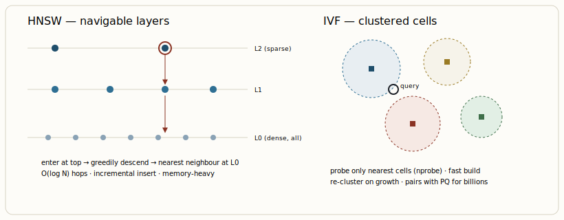

# Vector databases & semantic search

[← The data layer: cubes, medallion, semantic layer, feature stores](03-the-data-layer-cubes-medallion-semantic-layer-feature-stores.md) · [Guide index](README.md) · [Graph databases & GraphRAG →](05-graph-databases-graphrag.md)

---

> A vector database stores embeddings and answers one question fast: "which N stored vectors are closest to this query vector?" The whole craft is doing that *approximately* but with high recall, at scale, while also filtering on metadata.

## The index is the database

Exact nearest-neighbour search is brute force. To scale, vector DBs build an **Approximate Nearest Neighbour (ANN)** index that trades a sliver of recall for orders-of-magnitude speed. Two families dominate:

### HNSW — Hierarchical Navigable Small World

The default in nearly every modern engine. HNSW builds a multi-layer graph: sparse "express lane" layers on top for coarse navigation, dense layers below for fine-grained search. A query enters at the top, greedily hops toward the nearest neighbour, and descends layer by layer. Search complexity grows *logarithmically* with corpus size — which is why it handles billions of vectors. It supports incremental inserts without rebuilding, but costs more memory and has slower build times.

### IVF — Inverted File Index

Clusters vectors with k-means into *cells*; a query searches only the few nearest cells (`nprobe` of them). Faster to build and lighter on memory, but k-means cluster quality degrades in high dimensions (the curse of dimensionality again), and it needs periodic re-clustering as the corpus grows. Often combined with product quantization (IVF-PQ) to compress vectors for billion-scale memory budgets.

***Figure 4.** The two dominant ANN indexes. HNSW's layered graph gives logarithmic search and cheap inserts at a memory cost; IVF's k-means cells give fast builds and low memory but degrade in very high dimensions and need re-clustering.*

## Hybrid search — the production default

Pure semantic (dense) search misses exact terms: product codes, proper nouns, citations, rare jargon don't cluster reliably in embedding space. **Hybrid search** fuses dense vector similarity with sparse keyword scoring (BM25), then merges the ranked lists (e.g. reciprocal rank fusion). This is the single highest-leverage retrieval upgrade for most RAG systems. As of 2026, Weaviate, Qdrant, Milvus, LanceDB, and Pinecone support it natively; plain pgvector and ChromaDB do not, and bolt it on at the application layer.

## Choosing a vector store

| Engine | Model | Native hybrid | Sweet spot | Pick it when… |
| --- | --- | --- | --- | --- |
| **pgvector** | Postgres extension | no | < ~5M vectors | You already run Postgres and want vectors + relational data in one transaction. With HNSW it matches dedicated DBs at 1M scale; query is rarely the bottleneck (embedding gen dominates). |
| **Qdrant** | Rust, OSS + cloud | yes | 1M–100M, filtered | You need best-in-class *filtered* search and want to self-host. Strong single-node latency. |
| **Weaviate** | OSS + cloud | yes | Hybrid + built-in vectorization | You want hybrid out of the box and modules that embed text for you; good DX. |
| **Milvus** | OSS (Zilliz) | yes | 100M – billions | You're at billion-vector scale and need mature sharding/partitioning and GPU indexing. Budget for Kubernetes ops. |
| **Pinecone** | Managed only | proprietary | Zero-ops production | You want sub-100ms at scale with no infra to run and accept usage-based cost and less recall-tuning control. |
| **Chroma / LanceDB** | OSS, embedded | partial | Prototyping, local | Fast iteration, notebooks, edge/embedded use. |

> **WARNING — Benchmark honestly**  
> A headline "50K QPS" is meaningless if recall dropped to 0.7. Always measure *recall@K and throughput together*, and specifically measure **p95 latency under metadata filters** — some engines fall off a cliff when a filter narrows results below ~1% of the corpus. Also measure cold-start and reindex time; almost nobody does, and it bites in production.

---

[← The data layer: cubes, medallion, semantic layer, feature stores](03-the-data-layer-cubes-medallion-semantic-layer-feature-stores.md) · [Guide index](README.md) · [Graph databases & GraphRAG →](05-graph-databases-graphrag.md)
