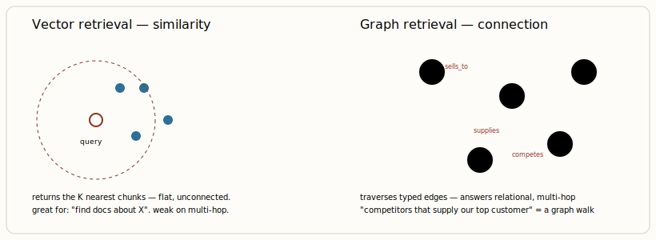

# Graph databases & GraphRAG

[← Vector databases & semantic search](04-vector-databases-semantic-search.md) · [Guide index](README.md) · [RAG patterns: naïve → advanced → agentic →](06-rag-patterns-na-ve-advanced-agentic.md)

---

> Vector search retrieves chunks that *look* similar. Graph retrieval retrieves facts that are *actually connected*. For multi-hop reasoning — "which suppliers of our top customer are also competitors?" — that distinction separates a system that answers from one that hallucinates.

## What a graph database represents

A property graph models data as **nodes** (entities) and **relationships** (typed, directed edges), each carrying key–value *properties*. The schema is the relationships themselves. Neo4j is the most adopted engine and, importantly for AI, supports both relationship queries (the Cypher language) and a native vector index — enabling hybrid retrieval inside one store. TigerGraph and ArangoDB are the main alternatives; the classic graph use cases (fraud rings, recommendations, supply-chain, identity resolution) still earn their keep independently of AI.

## GraphRAG — knowledge graphs as retrieval context

**GraphRAG**, popularised by Microsoft Research, replaces (or augments) the vector store with a knowledge graph as the retrieval source. The pipeline:

1. **Extract** entities and relationships from documents (LLM-assisted or rule-based) → build the graph.
2. **Community detection** (e.g. Leiden) clusters the graph into themes; the LLM summarises each community at multiple levels.
3. **At query time**, do *local* search (a node's neighbourhood) for specifics and *global* search (community summaries) for "what are the main themes?" questions.

***Figure 5.** Vector vs. graph retrieval. The same query that a vector store answers with "similar text" a graph answers by **traversing explicit relationships**. Production GraphRAG usually combines both: vectors for entry points, graph for the hops.*

## When graph beats vector — and when it doesn't

| Workload | Vector RAG | GraphRAG |
| --- | --- | --- |
| Single-hop fact lookup ("encyclopedic") | strong — often *better* than graph here | can underperform |
| Multi-hop / relational reasoning | weak — misses connections | strong — large measured gains on comprehensiveness |
| Whole-corpus "what are the themes?" | weak | strong — community summaries shine |
| Agent long-term memory over time | flat recall | temporal KGs (Graphiti/Zep, Cognee) lead on long-memory benchmarks |
| Cost & operational simplicity | cheap, simple | expensive indexing, graph skills needed |

> **WARNING — The failure mode**  
> GraphRAG's quality is dominated by *entity-extraction quality*. Bad entities → bad relationships → a bad graph → RAG that is *worse* than plain vectors, not better. Teams have built GraphRAG and walked it back. Do not adopt it unless your queries are genuinely relational and you can validate extraction. Measure first on GraphRAG-Bench / your own query distribution.

> **KEY — Pragmatic default**  
> Start with hybrid vector search. Add a graph only when you can name the multi-hop questions it must answer and prove vectors fail them. The common production shape is a **hybrid**: vector store (e.g. Qdrant) for semantic entry points + Neo4j for relationship traversal, orchestrated together.

---

[← Vector databases & semantic search](04-vector-databases-semantic-search.md) · [Guide index](README.md) · [RAG patterns: naïve → advanced → agentic →](06-rag-patterns-na-ve-advanced-agentic.md)
