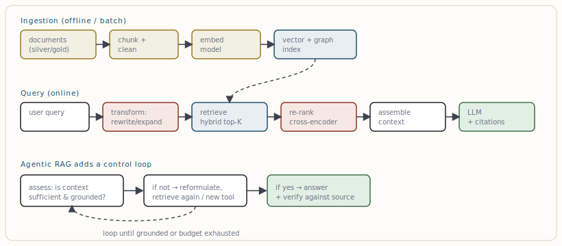

# RAG patterns: naïve → advanced → agentic

[← Graph databases & GraphRAG](05-graph-databases-graphrag.md) · [Guide index](README.md) · [Structured LLM outputs & constrained decoding →](07-structured-llm-outputs-constrained-decoding.md)

---

> Retrieval-Augmented Generation injects relevant external knowledge into the prompt at query time. It is the cheapest, fastest way to give a model facts it never learned — and the place most "the AI made things up" problems are actually solvable.

RAG exists because a model's weights are a frozen snapshot: a knowledge cutoff, no access to your private data, and no way to cite. RAG closes that gap by retrieving documents and placing them in context, so the model *reasons over* supplied evidence instead of recalling from memory. The architecture has three maturity tiers.

***Figure 6.** The RAG pipeline. Ingestion (top) is an offline data product; query (middle) is the online path. The decisive quality levers are **query transformation** and **re-ranking**, not the vector DB. Agentic RAG (bottom) wraps the path in a self-correcting loop.*

### Tier 1 — Naïve RAG

Embed query → top-K vector search → stuff chunks into the prompt → generate. Easy to build, and the source of most disappointment. Failure modes: irrelevant chunks (low precision), missing context split across chunks, lost-in-the-middle (the model ignores the middle of a long context), and confident hallucination when retrieval returns nothing useful.

### Tier 2 — Advanced RAG

The same skeleton, hardened at the two points that actually move quality:

- **Query transformation** — rewrite vague queries, expand with synonyms, or decompose multi-part questions (multi-query / HyDE).
- **Hybrid retrieval** — dense + BM25 fusion (§4) to catch exact terms.
- **Re-ranking** — retrieve a generous top-K, then re-score with a cross-encoder and keep the best few. This is the highest-ROI single addition to most RAG systems.
- **Smart chunking** — semantic or structure-aware splits, with overlap and parent-document retrieval so the model gets whole sections, not fragments.
- **Grounded generation** — instruct the model to answer only from context and cite chunk IDs, enabling verification.

### Tier 3 — Agentic RAG

Retrieval becomes a *decision*, not a fixed step. An agent assesses whether retrieved context is sufficient and grounded; if not, it reformulates the query, retrieves again, or routes to a different source (a graph, a SQL tool, the web). It can plan multi-step lookups and verify its answer against sources before returning. This is where retrieval meets the orchestration layer (§8) — and where most 2026 production RAG is heading.

> **KEY — RAG vs. fine-tuning, in one line**  
> Use **RAG for facts** (knowledge that changes, must be cited, or is private) and **fine-tuning for form** (tone, format, domain behaviour). They are complementary, not competing — see §10. Roughly 80% of "we need to fine-tune" requests are solved by better retrieval first.

---

[← Graph databases & GraphRAG](05-graph-databases-graphrag.md) · [Guide index](README.md) · [Structured LLM outputs & constrained decoding →](07-structured-llm-outputs-constrained-decoding.md)
