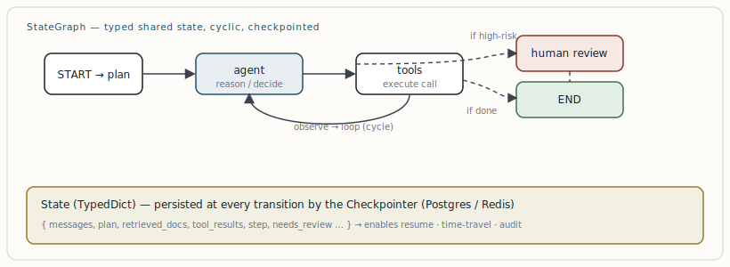

# Agent frameworks: LangChain vs. LangGraph

[← Structured LLM outputs & constrained decoding](07-structured-llm-outputs-constrained-decoding.md) · [Guide index](README.md) · [Multi-agent orchestration patterns →](09-multi-agent-orchestration-patterns.md)

---

> The most common framework question is a false dichotomy. LangChain and LangGraph are not alternatives — they are two layers of the same stack, built by the same team, solving different problems.

## What each actually is

**LangChain** is the high-level toolkit: model abstractions, 600+ provider integrations (chat models, retrievers, vector-store connectors, tools), and LCEL — the *LangChain Expression Language* — for composing components with a pipe operator into chains. It gets you from zero to a working LLM app in hours. Its native control flow is a **DAG**: data flows one direction, tasks run in sequence. Perfect for linear input→output workflows; insufficient the moment an agent needs to loop.

**LangGraph** is the low-level runtime: a **StateGraph** where nodes mutate a shared, typed state object, edges branch on conditions, and the engine supports *cycles, persistence, and streaming*. It is the production backbone — its checkpointing makes execution durable, resumable, and auditable. As of late 2025, LangChain's own `create_agent` runs *on top of* LangGraph's engine. So the real question isn't "which" — it's "how high up the abstraction do I need to stay?"

> **KEY — The decision, precisely**  
> Stay on the high-level `create_agent` until you need to *intercept state mid-execution*, add a *human review step*, implement *conditional retry logic*, or build *multi-agent handoffs*. The moment you hit any of those, drop to an explicit `StateGraph`. That is the intended path, not a workaround. Note: the old `AgentExecutor` is deprecated — don't start new work on it.

## Why state is the whole game

In a LangChain agent loop, state is implicit and scattered. In LangGraph it is **explicit and typed** — usually a `TypedDict` that persists and is updated as it flows between nodes. That single design choice unlocks the capabilities production demands:

- **Durable execution** — a checkpointer (Postgres/Redis) persists state at every transition. A pod restart mid-workflow resumes from the last checkpoint instead of losing context.
- **Human-in-the-loop** — the graph can pause, wait for approval, and resume. First-class, not custom middleware. Critical for regulated workflows.
- **Time-travel debugging & audit** — replay from any checkpoint; the full decision history is an audit trail out of the box.
- **Multi-session resume** — a user returns after three days and the exact state is restored.



***Figure 7.** A LangGraph StateGraph. Nodes mutate one typed state object; **conditional edges** branch (e.g. route high-risk actions to a human); a cycle lets the agent loop tools→reason until done. The checkpointer persists state at every step — the foundation of resume, time-travel, and audit.*

```python
from langgraph.graph import StateGraph, START, END
from langgraph.checkpoint.postgres import PostgresSaver

class State(TypedDict):
    messages: list
    needs_review: bool

g = StateGraph(State)
g.add_node("agent", call_model)
g.add_node("tools", run_tools)
g.add_node("review", human_gate)        # pauses for approval
g.add_edge(START, "agent")
g.add_conditional_edges("agent", route)  # → tools | review | END
g.add_edge("tools", "agent")            # the loop / cycle
app = g.compile(checkpointer=PostgresSaver(...))  # durable, resumable
```

> **NOTE — Don't optimise the wrong layer**  
> Teams burn weeks debating LangGraph vs. LangChain when the real cost driver is the *inference layer*: a well-tuned vLLM backend serves time-to-first-token under ~200ms; a poorly provisioned managed endpoint can sit at 1–3 seconds under load. That latency gap dwarfs any framework efficiency difference. Profile the model serving before blaming the orchestrator.


---

[← Structured LLM outputs & constrained decoding](07-structured-llm-outputs-constrained-decoding.md) · [Guide index](README.md) · [Multi-agent orchestration patterns →](09-multi-agent-orchestration-patterns.md)
