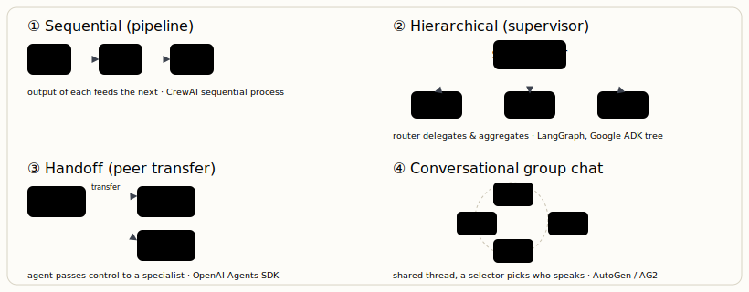

# Multi-agent orchestration patterns

[← Agent frameworks: LangChain vs. LangGraph](08-agent-frameworks-langchain-vs-langgraph.md) · [Guide index](README.md) · [Customizing the model: RAG, fine-tuning, LoRA & custom data →](10-customizing-the-model-rag-fine-tuning-lora-custom-data.md)

---

> When one agent's context, tools, or responsibilities grow unwieldy, you split the work across specialised agents. Multi-agent orchestration is how you coordinate them — and underneath every framework sit just a few patterns.

The 2026 landscape settled into a small set of serious frameworks, each committing to a different orchestration abstraction. Knowing the *patterns* lets you read any framework — and decide whether you need multiple agents at all.

## The four orchestration patterns

***Figure 8.** Every multi-agent framework is a flavour of one of these. **Sequential** for pipelines, **hierarchical** for delegate-and-aggregate, **handoff** for routing to specialists, **group chat** for debate/consensus. Graph-based frameworks can express all four.*

## The frameworks, compared

| Framework | Orchestration model | State / persistence | Model lock-in | Best for |
| --- | --- | --- | --- | --- |
| **LangGraph** (LangChain) | Directed graph w/ conditional edges | **Built-in checkpointing + time-travel** | Agnostic | Production, regulated, complex/cyclic control flow, audit. Steepest curve; most control; best token efficiency. |
| **CrewAI** | Role-based "crews", process types | Task outputs passed sequentially | Agnostic | Fastest idea→prototype (hours). Teams new to agents, work that splits into clear roles. Higher token overhead on simple flows. |
| **OpenAI Agents SDK** | Explicit handoffs + sandboxed tools | Context vars (ephemeral by default) | OpenAI models | Lowest-friction GPT-centric agents; sub-agents and sandbox execution. |
| **Claude Agent SDK** (Anthropic) | Tool-use loop + sub-agents, native MCP | Via MCP servers | Claude models | Deliberately minimal: agent = model + tools + loop. Safety expressed at model level. |
| **AutoGen → AG2** | Conversational GroupChat, event-driven | Conversation history (in-memory) | Agnostic | Multi-party dialogue, code-writing/execution, research-grade flexibility. Harder to terminate predictably; mind the v0.2→1.0/AG2 split. |
| **Microsoft Agent Framework** | Graph-based (unifies AutoGen + Semantic Kernel) | Pluggable | Agnostic, Azure-native | .NET / Azure enterprises. (Old AutoGen is now maintenance-mode.) |
| **Google ADK** | Hierarchical agent tree | Session state, pluggable backends | Gemini-optimised, multi-provider | Multimodal agents, GCP-native stacks. |

> **KEY — Cost lever: model tiering**  
> Agnostic frameworks let you assign different models per agent. The standard production move: a cheap, fast model (a "mini"/Haiku tier) for triage and routing agents, a capable model for the hard reasoning agents. Mixing models this way commonly cuts cost 40–60% versus running one premium model everywhere. Note also that framework choice alone can swing benchmark scores by double-digit points on the *same* model — the scaffold matters.

## When NOT to go multi-agent

> **WARNING — Resist the urge**  
> Multi-agent systems add coordination overhead, latency, token cost, and new failure modes (agents talking past each other, loops that won't terminate). For a single agent calling one or two tools, a vendor SDK or a single LangGraph agent is faster and cheaper. Reach for multi-agent only when the work genuinely decomposes into specialists *and* a single agent's context or tool surface has become unmanageable. Build evals, observability, and failure recovery before adding agents — that is where reliability actually comes from.

---

[← Agent frameworks: LangChain vs. LangGraph](08-agent-frameworks-langchain-vs-langgraph.md) · [Guide index](README.md) · [Customizing the model: RAG, fine-tuning, LoRA & custom data →](10-customizing-the-model-rag-fine-tuning-lora-custom-data.md)
