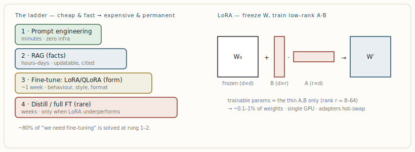

# Customizing the model: RAG, fine-tuning, LoRA & custom data

[← Multi-agent orchestration patterns](09-multi-agent-orchestration-patterns.md) · [Guide index](README.md) · [Safety-conscious architecture & the trust boundary →](11-safety-conscious-architecture-the-trust-boundary.md)

---

> There is a disciplined order for adapting a model to your problem, and most teams skip straight to the most expensive option. The rule that saves the most money: **fine-tune for form, retrieve for facts.**

## The customization ladder

Climb in order; only ascend when the rung below is demonstrably exhausted. Each step costs more in engineering, compute, and maintenance.

***Figure 9.** Left: the customization ladder — exhaust each rung before climbing. Right: LoRA freezes the base weight matrix W₀ and learns a tiny low-rank update B·A, training ~0.1–1% of parameters. QLoRA additionally quantizes W₀ to 4-bit so even 70B models fine-tune on one GPU.*

## RAG vs. fine-tuning — the decision

| Need | Use | Why |
| --- | --- | --- |
| Knowledge that changes (prices, policies, news) | **RAG** | Update the index, not the weights. Fine-tuning bakes in stale facts and won't reliably "learn" new ones. |
| Private / proprietary documents, must cite | **RAG** | Provenance and access control live in the data layer; you can show sources. |
| Consistent output format / structure at scale | **Fine-tune (LoRA)** | Behaviour the prompt can't reliably enforce across millions of calls. |
| Domain tone, vocabulary, reasoning style | **Fine-tune (LoRA)** | "Form" — how to respond, not what facts to state. |
| Refusal patterns / safety behaviour | **Fine-tune** | Shapes default behaviour reliably. |
| Lower latency than a long RAG prompt | **Fine-tune**, then maybe RAG | Distil the behaviour into weights to shorten prompts. |

The mature 2026 sequence is **Prompt → RAG → Fine-tune → Distill**, and the highest-ROI fine-tune is a thin LoRA/QLoRA adapter on a strong base model *paired with* retrieval — not replacing it. A medical assistant, for example, uses LoRA for clinical tone and documentation format while RAG supplies current drug interactions.

## Parameter-efficient fine-tuning (PEFT)

Full fine-tuning updates every weight: expensive, risks **catastrophic forgetting**, and locks you to one base checkpoint. It is almost never the right answer now. PEFT trains a small set of added parameters while freezing the base:

- **LoRA** — inserts low-rank adapter matrices (rank 8–64) into attention/MLP layers; ~0.1–1% of params, quality comparable to full FT. The workhorse — use it for ~90% of tasks.
- **QLoRA** — quantizes the frozen base to 4-bit (NF4) while keeping adapters in higher precision; this is what made single-GPU 70B fine-tuning viable. Use it when GPU memory is constrained.
- **DoRA** — weight-decomposed LoRA; a common 2026 starting config is `r=16`, DoRA, `target_modules="all-linear"`, LR `2e-4` cosine.

Alignment to preferences has largely shifted from RLHF to **DPO** (Direct Preference Optimization) — cheaper, more stable, comparable quality — typically run as SFT then DPO.

## Custom datasets — quality over quantity

Data is where fine-tunes are won or lost. The durable lesson (the "LIMA" result): **1,000 hand-curated examples often beat 100,000 noisy ones.** Practical discipline:

- Match the exact *chat template* and tokenizer you'll use at inference; mismatched `pad_token`/template silently degrades output.
- Hold out a real validation set; monitor eval loss and stop early — LoRA still overfits small datasets.
- Evaluate on *out-of-distribution* examples, not just the held-out split, and on your domain metric plus a general benchmark to catch regressions.
- Serving: with vLLM `--enable-lora`, dozens of adapters hot-swap on a single base-model load — economical multi-tenant fine-tunes. QLoRA adapters must have the base de-quantized to FP16/BF16 before merging.

> **NOTE — Order of operations**  
> Before fine-tuning: fix the prompt, build a real RAG pipeline, and *write evals* — in that order. The question "should we fine-tune?" almost always arrives before the prerequisite work is done, and the honest answer is usually "not yet." A competent QLoRA on an 8B base reaches production for tens of dollars of compute and ~a week of engineering — cheap, but only worth it for the right, narrow problem.

---

[← Multi-agent orchestration patterns](09-multi-agent-orchestration-patterns.md) · [Guide index](README.md) · [Safety-conscious architecture & the trust boundary →](11-safety-conscious-architecture-the-trust-boundary.md)
