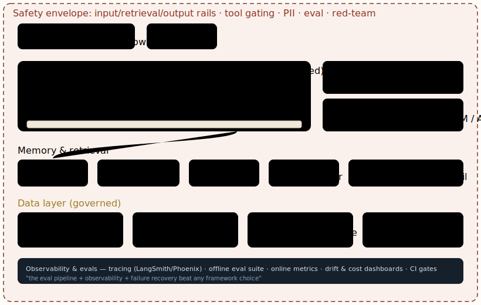

# Reference architecture: putting it together

[← Safety-conscious architecture & the trust boundary](11-safety-conscious-architecture-the-trust-boundary.md) · [Guide index](README.md) · [Decision matrices & selection guide →](13-decision-matrices-selection-guide.md)

---

> Every pattern in this paper assembles into one deployable blueprint. The diagram below is a production-grade agentic RAG system with the trust boundary, the data layer, hybrid retrieval, a stateful orchestrator, and observability — the shape most serious 2026 systems converge on.

***Figure 11.** Reference architecture for production agentic RAG. A durable LangGraph orchestrator with gated tools and human review, hybrid + graph retrieval feeding grounded generation, a governed data layer beneath, tiered model serving with LoRA adapters, all wrapped in the safety envelope and underpinned by observability and evals.*

## Build order (so you don't paint yourself into a corner)

1. **Data layer first.** Establish medallion zones and the governed surfaces (semantic layer, indexed corpus with lineage). Everything downstream inherits this quality.
2. **Retrieval before reasoning.** Stand up hybrid search + re-ranking and measure recall/precision on a real query set *before* adding an agent.
3. **Single agent, structured outputs.** One agent, typed tool calls, constrained decoding. Add the orchestrator only when control flow demands cycles or human review.
4. **Safety envelope from day one.** Rails and tool gating are cheaper to design in than to retrofit after an incident.
5. **Evals + observability in parallel with everything.** They are not a phase; they are how you know any change helped.
6. **Multi-agent / fine-tuning last.** Only when a single agent + RAG provably can't meet the bar.

---

[← Safety-conscious architecture & the trust boundary](11-safety-conscious-architecture-the-trust-boundary.md) · [Guide index](README.md) · [Decision matrices & selection guide →](13-decision-matrices-selection-guide.md)
