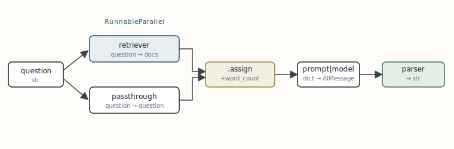

# LCEL and the Runnable protocol

[← Two layers: the framework and the runtime](01-two-layers-the-framework-and-the-runtime.md) · [Guide index](README.md) · [The engine underneath: Pregel super-steps →](03-the-engine-underneath-pregel-super-steps.md)

---

> Everything in LangChain — a prompt, a chat model, an output parser, a retriever, a tool, even a whole agent — implements one interface: `Runnable`. LangChain Expression Language (LCEL) is nothing more than operator overloading on that interface. If you understand `Runnable`, you understand how data flows through every chain you will ever write.

## The interface

A `Runnable` is any object exposing a small, uniform set of methods. Every method comes in sync and async form, and single and batched form, so any component you compose automatically inherits streaming, batching, and async for free.

```python
# The Runnable contract (langchain_core.runnables) -- conceptual shape.
class Runnable:
    def invoke(self, input, config=None): ...        # one input  -> one output
    async def ainvoke(self, input, config=None): ...  # async variant
    def batch(self, inputs, config=None): ...         # many inputs, parallelised
    async def abatch(self, inputs, config=None): ...
    def stream(self, input, config=None): ...         # yields output chunks
    async def astream(self, input, config=None): ...
    async def astream_events(self, input, config=None): ...  # structured event feed
```

The single most important consequence: because the contract is uniform, two runnables can be wired together and the composite is *also* a runnable. Composition is closed under the interface. That is what the pipe operator expresses.

## Composition: the pipe builds a RunnableSequence

The `|` operator is overloaded to construct a `RunnableSequence`: the output of `.invoke()` on the left becomes the input to the right. No data is moved when you write the chain; you are building a graph object. Execution happens only when you call `.invoke()` on the composite.

```python
from langchain_core.prompts import ChatPromptTemplate
from langchain_core.output_parsers import StrOutputParser
from langchain_openai import ChatOpenAI

prompt = ChatPromptTemplate.from_template("Summarise in one sentence: {text}")
model  = ChatOpenAI(model="gpt-5.3", temperature=0)
parser = StrOutputParser()

# `chain` is a RunnableSequence: prompt -> model -> parser
chain = prompt | model | parser

chain.invoke({"text": long_article})        # str out
chain.batch([{"text": a}, {"text": b}])      # parallelised across inputs
for chunk in chain.stream({"text": long_article}):
    print(chunk, end="", flush=True)         # token streaming, for free
```

> **NOTE — Why declarative matters**  
> Because the chain is a data structure, not a function call, LangChain can introspect it: stream intermediate tokens, parallelise `batch`, attach retries and fallbacks at any node, and emit a full trace to LangSmith — all without you changing the chain. The chain you prototype is the chain you ship.

## The four structural primitives

Beyond the sequence, four runnables give you all the control flow LCEL needs. These are the verbs of the language.

```python
from langchain_core.runnables import (
    RunnableParallel, RunnablePassthrough, RunnableLambda, RunnableBranch,
)

# 1) RunnableParallel -- run branches concurrently, collect into a dict.
#    The classic RAG input map: fetch context and pass the question through
#    at the same time, on separate threads.
setup = RunnableParallel(
    context=retriever,                  # a Runnable: question -> docs
    question=RunnablePassthrough(),     # forwards the input unchanged
)

# 2) RunnablePassthrough.assign -- add keys to a dict without dropping the rest.
enrich = RunnablePassthrough.assign(
    word_count=lambda x: len(x["question"].split()),
)

# 3) RunnableLambda -- lift any plain Python function into a Runnable so it
#    composes with `|` and inherits async/stream/trace.
clean = RunnableLambda(lambda x: x.strip().lower())

# 4) RunnableBranch -- declarative if/elif/else over the input.
route = RunnableBranch(
    (lambda x: x["lang"] == "sql",     sql_chain),
    (lambda x: x["lang"] == "python",  py_chain),
    fallback_chain,                    # default
)

rag = setup | enrich | prompt | model | parser
```

That RAG chain is worth tracing by hand, because it shows the data shape changing at each arrow. The input is a bare question string. `RunnableParallel` turns it into `{context: [docs], question: "..."}` by running the retriever and a passthrough at once. `.assign` adds `word_count` without discarding `context` or `question`. The prompt template consumes that dict and emits messages; the model emits an `AIMessage`; the parser flattens it to a string.



***Fig. 2** — One LCEL chain as a typed DAG. The shape of the value is annotated under each node. `RunnableParallel` is the only fan-out; everything else is a linear pipe. This is a directed *acyclic* graph — LCEL cannot loop, which is precisely the boundary where LangGraph takes over (§3).*

## Resilience and configuration, declared not coded

Because every node is a `Runnable`, cross-cutting concerns attach as wrappers rather than as `try/except` scattered through your logic.

```python
# Retries with backoff, and a cheaper fallback model if the primary fails.
robust_model = (
    ChatOpenAI(model="gpt-5.3")
        .with_retry(stop_after_attempt=3)          # exponential backoff
        .with_fallbacks([ChatAnthropic(model="claude-haiku-4.5")])
)

# RunnableConfig threads metadata, callbacks, tags and concurrency limits
# through the *entire* chain without changing any node's signature.
chain.invoke(
    {"text": doc},
    config={"tags": ["prod", "summary"], "metadata": {"tenant": "acme"},
            "max_concurrency": 8, "run_name": "nightly-summary"},
)
```

> **KEY — The LCEL boundary**  
> LCEL is a *directed acyclic* composition language. It is superb for retrieval, extraction, classification, and any fixed-topology pipeline. It cannot express “call the model, inspect the result, maybe call a tool, then loop back.” That requires cycles and shared mutable state — the job of LangGraph. In practice you use both: LCEL chains become the *bodies of LangGraph nodes*.


---

[← Two layers: the framework and the runtime](01-two-layers-the-framework-and-the-runtime.md) · [Guide index](README.md) · [The engine underneath: Pregel super-steps →](03-the-engine-underneath-pregel-super-steps.md)
