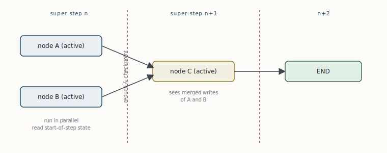

# The engine underneath: Pregel super-steps

[← LCEL and the Runnable protocol](02-lcel-and-the-runnable-protocol.md) · [Guide index](README.md) · [StateGraph: state, reducers, nodes, edges →](04-stategraph-state-reducers-nodes-edges.md)

---

> LangGraph does not “run your functions in order.” It executes them on a message-passing engine modelled on Google's Pregel, using the Bulk Synchronous Parallel (BSP) discipline. Internalising this model is the difference between an agent that behaves and one that mysteriously double-writes its state on resume.

## Channels, not variables

The graph's state is not a single mutable object that nodes edit in place. It is a set of **channels** — one per key in your state schema. A node never mutates state; it returns a *partial update*, and the engine writes that update into the relevant channels using each channel's *reducer* (§4). Nodes communicate only by reading channels at the start of a step and writing channels at the end.

## The super-step loop

Execution proceeds in discrete **super-steps**. Each super-step has three phases:

1. **Plan** — the engine determines which nodes are “active” (have inbound messages on their channels from the previous step).
2. **Execute** — all active nodes run, conceptually in parallel, each reading the channel values as they were at the *start* of the step. A node cannot see another node's writes from the same step.
3. **Update** — every node's returned partial is applied to the channels through the reducers. This is the synchronisation barrier: the step does not end until all active nodes finish and their writes are merged.

The loop repeats until a super-step produces no further messages — i.e. no node is scheduled — at which point the graph halts. A node that wants to continue the computation does so by writing to a channel that another node (or itself, via a cycle) reads. This is why a LangGraph agent can loop indefinitely: the ReAct cycle is simply a node that keeps re-scheduling the model node until a stop condition routes to `END`.

***Fig. 3** — BSP execution. Within a super-step, active nodes run concurrently against a frozen snapshot of the channels; their updates are merged through reducers at the barrier, where a checkpoint is also written. The next step's nodes see the merged result. Parallelism is free *within* a step; ordering is enforced *across* steps.*

## The consequence that bites: checkpoints are at barriers, nodes re-run whole

The engine writes a checkpoint at each super-step boundary — never mid-node. So when execution stops (an interrupt, a crash, a retry) and later resumes, **the affected node runs again from the top of its function.** Any code and any side effect before the pause executes a second time.

> **WARNING — Design for idempotency**  
> If a node inserts a database row, sends an email, or charges a card before the barrier, resuming the graph will do it twice. Make node bodies idempotent: use upserts and idempotency keys, read-before-write, or move the side effect to *after* the point where the state that records “done” is committed. This is not a corner case — it is the normal behaviour of a durable executor, and the most common source of production bugs in LangGraph systems.

Two corollaries follow directly from the model and are worth committing to memory:

- **Graph structure is not part of the checkpoint contract.** You may add or remove nodes and edges and still resume existing threads; determinism rules apply to *state*, not topology.
- **Parallel branches must not race on the same channel** unless that channel has a reducer that merges (e.g. `operator.add`). Two nodes writing a plain scalar in the same super-step is a conflict; two nodes appending to a reduced list is well-defined.

---

[← LCEL and the Runnable protocol](02-lcel-and-the-runnable-protocol.md) · [Guide index](README.md) · [StateGraph: state, reducers, nodes, edges →](04-stategraph-state-reducers-nodes-edges.md)
