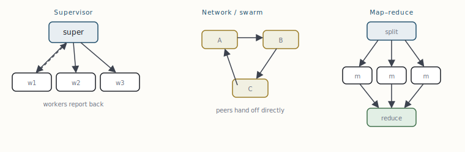

# A catalogue of agentic design patterns

[← Tools, the ReAct loop, and structured output](08-tools-the-react-loop-and-structured-output.md) · [Guide index](README.md) · [Data cubes and the semantic layer as a governed tool →](10-data-cubes-and-the-semantic-layer-as-a-governed-tool.md)

---

> Patterns are how teams talk about agent topology without re-deriving it each time. Every one below is a specific arrangement of the StateGraph primitives from §4–§8. They compose: a supervisor's workers can each be a ReAct agent that internally reflects. Pick the simplest shape that meets the requirement — complexity in the graph is complexity you will debug at 2 a.m.



***Fig. 4** — Three multi-actor topologies. **Supervisor**: a router delegates to specialised workers and aggregates — auditable, the default for production. **Network**: peers hand control to each other — flexible, harder to bound. **Map–reduce**: fan a task into parallel identical workers, then merge — the throughput pattern.*

## Single-graph patterns

**Pipeline (sequential).** Fixed chain of nodes, each transforming state. Intent: deterministic multi-step processing (extract → validate → enrich → write). Use when the steps never vary. Failure mode: none structural — if you are reaching for branches, you have outgrown it.

**Router (branch).** One classifier node, then a conditional edge to specialised sub-chains. Intent: send each input to the handler built for it. Use for intent classification, language/domain routing, triage. Failure mode: a mis-classification sends the request down the wrong path silently — log the routing decision and stream it.

**ReAct (tool loop).** The §8 skeleton: reason → act → observe → repeat. Intent: open-ended tasks needing tools. Failure mode: unbounded loops and tool thrash — always cap iterations and detect “no progress.”

**Reflection (self-critique).** A generator node produces a draft; a critic node evaluates it against criteria; a conditional edge loops back for revision until the critic passes or a budget is hit. Intent: quality-sensitive generation (code, analysis, writing). Failure mode: the critic and generator collude into shallow approval — give the critic a concrete rubric and a hard revision cap.

## Map–reduce with the Send API

When you must run the *same* work over a list of unknown length — summarise each of N documents, evaluate each of N candidates — you cannot wire fixed edges, because N is only known at runtime. The `Send` primitive fans out dynamically: a node returns a list of `Send(node, payload)` directives, and the engine schedules one instance of the target node per payload, all in the same super-step. A reduced channel collects their outputs.

```python
from langgraph.types import Send

def fan_out(state):
    # one Send per document -> N parallel `summarise` nodes this super-step.
    return [Send("summarise", {"doc": d}) for d in state["documents"]]

def summarise(state):
    s = model.invoke(f"Summarise:\n{state['doc']}").content
    return {"summaries": [s]}            # operator.add reducer collects all N

def reduce(state):
    return {"report": model.invoke("Combine:\n" + "\n".join(state["summaries"]))}

g.add_conditional_edges("split", fan_out, ["summarise"])  # dynamic fan-out
g.add_edge("summarise", "reduce")                          # implicit join
```

The join is implicit: because all `summarise` instances run in one super-step and write to the reduced `summaries` channel, the barrier (§3) merges them before `reduce` runs. This is the cleanest expression of fan-out/fan-in in the framework, and it is where the BSP model pays off directly.

## Supervisor (hierarchical)

A supervisor node owns the control flow: it reads the state, decides which worker should act next, and routes to it; each worker does its job and returns to the supervisor. The supervisor is itself usually an LLM choosing among named workers. This is the production default for multi-agent systems because the decision log *is* the supervisor's output — every delegation is visible and auditable.

```python
WORKERS = ["researcher", "analyst", "writer"]

def supervisor(state) -> dict:
    decision = router_model.with_structured_output(Route).invoke(state["messages"])
    return {"next": decision.next}      # "researcher" | "analyst" | "writer" | "DONE"

def route(state) -> str:
    return END if state["next"] == "DONE" else state["next"]

g.add_node("supervisor", supervisor)
for w in WORKERS:
    g.add_node(w, make_worker(w))
    g.add_edge(w, "supervisor")         # every worker reports back
g.add_conditional_edges("supervisor", route,
                        {**{w: w for w in WORKERS}, END: END})
g.add_edge(START, "supervisor")
```

**Network / swarm** removes the supervisor: workers hand off to each other directly via a routing field, which is more flexible (any peer can reach any peer) but much harder to bound and audit. Prefer supervisor unless you have a specific reason. **Plan-and-execute** splits cognition from action: one node writes a full plan, an executor walks it step by step, and a replan node revises when steps fail — good for long horizons, at the cost of rigidity if the plan is wrong. **Subgraphs** let a compiled graph be a node inside another graph, which is how you keep large systems modular: each subgraph owns its slice of state and is tested in isolation.

| pattern | topology | reach for it when | main failure mode |
| --- | --- | --- | --- |
| **Pipeline** | linear | fixed multi-step transform | outgrown when you add branches |
| **Router** | 1→N branch | heterogeneous inputs | silent mis-routing |
| **ReAct** | 2-node cycle | tool-using open tasks | unbounded loops / tool thrash |
| **Reflection** | gen↔critic cycle | quality-critical output | shallow self-approval |
| **Map–reduce** | fan-out / fan-in | same work over a list of N | cost blow-up; merge ambiguity |
| **Supervisor** | hub-and-spoke | multi-skill, needs audit | supervisor becomes bottleneck |
| **Network** | peer mesh | fluid hand-offs | hard to bound / debug |
| **Plan–execute** | plan → loop | long-horizon tasks | brittle if initial plan is wrong |


---

[← Tools, the ReAct loop, and structured output](08-tools-the-react-loop-and-structured-output.md) · [Guide index](README.md) · [Data cubes and the semantic layer as a governed tool →](10-data-cubes-and-the-semantic-layer-as-a-governed-tool.md)
