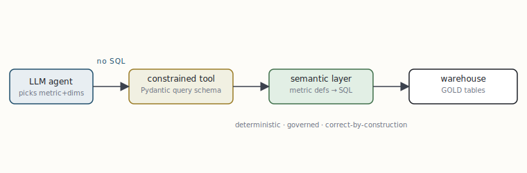

# Data cubes and the semantic layer as a governed tool

[← A catalogue of agentic design patterns](09-a-catalogue-of-agentic-design-patterns.md) · [Guide index](README.md) · [Reference implementation: a governed analytics agent →](11-reference-implementation-a-governed-analytics-agent.md)

---

> The fastest way to make an agent lie is to hand it a SQL connection. It will write a query that runs, returns a plausible number, and is quietly wrong — a mis-stated join, a double-counted fact, a filter that silently drops half the rows. The fix is not a better prompt. It is to put a **semantic layer** — the modern, queryable incarnation of the OLAP data cube — between the model and the warehouse, and to expose it as a *constrained* tool.

## Why raw text-to-SQL fails as an agent tool

Text-to-SQL asks the model to do two hard things at once: understand the question, and reconstruct the entire physical data model — tables, keys, join paths, grain, business logic — from a schema dump. Benchmarks through 2026 put frontier models at roughly 70–85% correctness on *clean* schemas, and 50–70% on messy enterprise databases. For analytics that feeds a decision, a 15–30% silent-error rate is disqualifying. Worse, the errors are not random noise; they are confident, well-formed numbers that differ subtly run to run.

## The data cube, modernised: the semantic layer

A data cube pre-organises facts along *dimensions* (time, geography, product, customer) and *measures* (revenue, count, margin) so an analyst can slice and dice without writing joins. The semantic layer (Cube, dbt's Semantic Layer / MetricFlow, Snowflake Cortex Analyst's semantic views) generalises this into a governed, code-defined contract: every metric, dimension, join path, and grain is declared *once*, centrally, and every consumer — dashboards, APIs, and now agents — queries that definition instead of raw tables.

```python
# A semantic-layer definition (Cube-style). Business logic is codified ONCE.
cube("orders", {
  "sql_table": "gold.fct_orders",          # points at the GOLD medallion layer
  "measures": {
    "net_revenue": {"sql": "amount - refunds", "type": "sum"},
    "order_count": {"type": "count"},
  },
  "dimensions": {
    "region":  {"sql": "region",       "type": "string"},
    "month":   {"sql": "order_month",  "type": "time"},
  },
  "joins": {"customers": {"relationship": "many_to_one",
                          "sql": "${orders}.cust_id = ${customers}.id"}},
})
```

Now the agent does not write SQL. It selects a *metric*, a set of *dimensions*, and *filters* — and the semantic layer compiles that to correct, deterministic SQL. The model literally cannot produce a bad join or a wrong aggregation, because it never expresses one. If it picks a valid metric and valid dimensions, the number is guaranteed correct and identical every run. The trade-off is coverage: the layer answers only what has been modelled. That is the right trade for governed analytics, where a defensible 90–95% within scope beats a confident 70% over everything.



***Fig. 5** — The agent never touches SQL or raw tables. It emits a typed metric request; the semantic layer compiles it against centrally-defined logic over the governed *gold* layer of the lakehouse. Correctness is a property of the layer, not of the prompt.*

## Implementing the constrained tool

The key move is to make the *tool's argument schema* mirror the semantic layer's vocabulary, with enums for the legal metrics and dimensions. The structured-output machinery from §8 then forces the model to choose only valid values — validation happens at decode time, before any query runs.

```python
from enum import Enum
from pydantic import BaseModel
from langchain_core.tools import tool

class Metric(str, Enum):
    net_revenue = "net_revenue"
    order_count = "order_count"

class Dimension(str, Enum):
    region = "region"
    month  = "month"

class MetricQuery(BaseModel):
    metric: Metric                       # enum -> model cannot invent a metric
    dimensions: list[Dimension] = []
    filters: dict[str, str] = {}
    time_range: str | None = None

@tool(args_schema=MetricQuery)
def query_cube(metric, dimensions, filters, time_range):
    """Answer a quantitative business question via the governed semantic layer."""
    sql = semantic_layer.compile(metric=metric, dimensions=dimensions,
                                 filters=filters, time_range=time_range)
    return semantic_layer.execute(sql)   # deterministic, correct-by-construction
```

Drop `query_cube` into the ReAct skeleton (§8) or give it to `create_agent`, and you have an analytics agent that is constitutionally unable to fabricate a metric. For questions *outside* the modelled scope, fall back to the guarded multi-agent NL2SQL pattern below — never to an unguarded SQL tool.

## When you must leave the cube: guarded NL2SQL

Ad-hoc questions that the semantic layer does not cover still need answering. The production pattern (used at scale by data teams at companies like LinkedIn and Bloomberg) splits the job across specialised agents instead of one model writing SQL blind: an *intent* agent clarifies the question, a *schema-retrieval* agent pulls only the relevant tables and their documentation, a *writer* drafts SQL, and a *validator* dry-runs it (`EXPLAIN`, row-count sanity, read-only role) before any result is trusted. It costs 10–20 model calls per query — the price of correctness off the modelled path.

|  | raw text-to-SQL | semantic layer tool |
| --- | --- | --- |
| **correctness** | 50–85%, error-prone | ~90–95% in scope, deterministic |
| **determinism** | varies run to run | identical every run |
| **governance** | none — any query | central metric definitions |
| **coverage** | anything expressible in SQL | only what is modelled |
| **failure** | silent wrong number | refuses out-of-scope question |

> **KEY — The architectural rule**  
> Point agents at the *gold* / semantic layer, never at raw or silver tables. A semantic layer is a constraint that converts the model's freedom — the thing that makes it hallucinate — into a small, validated set of legal moves. This is the data-side equivalent of constrained decoding: you do not ask the model to be trustworthy, you make untrustworthy outputs unrepresentable.


---

[← A catalogue of agentic design patterns](09-a-catalogue-of-agentic-design-patterns.md) · [Guide index](README.md) · [Reference implementation: a governed analytics agent →](11-reference-implementation-a-governed-analytics-agent.md)
